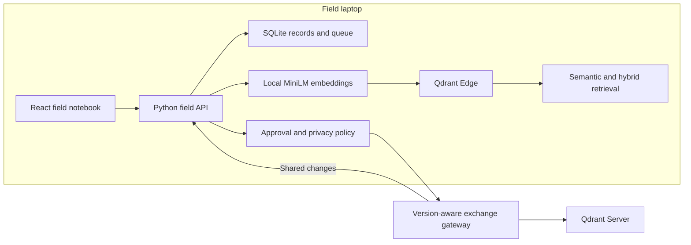

# KhojSetu

**Discover. Remember. Connect.**

Offline semantic memory for archaeological field research, built for Qdrant's **AI-Powered Edge Memory & Intelligence Platform** challenge.

A researcher records a find, searches related observations on the field laptop without internet, and exchanges approved knowledge with the team when connected. Grid, layer and material keep retrieval grounded in excavation context.


*Conceptual workflow animation; not a recording of live database activity.*

## Submission materials

- [Editable draw.io architecture](public/khojsetu-flow.drawio) — open in diagrams.net or draw.io Desktop; all nodes and connectors are editable.
- [Interactive pitch HTML](public/pitch.html) — download/open locally, or visit `/pitch.html` while running the app. GitHub's file view does not execute HTML.
- [Five-minute demonstration](DEMO.md)
- [Pitch background, dataset explanation and judge Q&A](PITCH-PREP.md)
- [Beginner setup, Docker explanation and manual commands](START-HERE.md)
- [GitHub submission and cleanup guide](SUBMISSION.md)

## Why this challenge, and why archaeology?

The Qdrant challenge calls for searchable on-device memory, offline vector/hybrid retrieval, intelligent local/shared decisions, synchronization with Qdrant Server, handling of changing information and a visible user interface.

Archaeology is our chosen use case. An observation becomes more useful with its location, layer and relationship to earlier findings. A field notebook that can retrieve related descriptions locally and preserve competing edits gives the challenge a concrete workflow.

Potential users include excavation teams, research programmes and archaeological consultancies. Faster retrieval and better team handover are proposed benefits to validate in a practitioner pilot; we do not claim established adoption or measured business savings.

## What works

| Capability | Current implementation |
| --- | --- |
| Local semantic memory | Real `qdrant-edge-py==0.8.0` Edge shard stored on the device |
| Local embeddings | Cached MiniLM ONNX model via FastEmbed; 384-dimensional dense vectors |
| Hybrid retrieval | Dense cosine and lexical sparse search in Edge; application combines rankings using reciprocal-rank fusion |
| Context filtering | Layer and material filters |
| Persistent field records | SQLite journal, local versions and durable pending state |
| Selective exchange | Sensitivity, researcher approval, visibility and priority rules; limited-link upload prioritization |
| Shared storage | Real Qdrant Server in Docker, accessed through a Python exchange gateway |
| Bidirectional changes | Approved uploads, incremental shared downloads, retry IDs and revision checks |
| Conflict review | Keep local, accept shared, or retain both notes |
| Evidence assistant | Extracts original retrieved notes with record IDs; no external LLM |
| Interface | Field station, archive, search, record form, knowledge exchange and activity |

The sample dataset is **40 synthetic archaeological records**, included in [backend/demo.json](backend/demo.json). They demonstrate the workflow and are not real discoveries or validated archaeological evidence. New field units start empty; choose **Load demo expedition** once to seed the sample data. Personal demo entries and runtime databases are excluded from Git.

## How Qdrant is used



The local API and cached model run on the laptop. Edge performs the actual vector retrieval; SQLite supplies record/queue state. The gateway writes shared vectors to Qdrant Server and maintains a revision journal. Synchronization is application-level record exchange, not a claim of built-in automatic Edge replication.

## Run on Windows

Requirements: Python **3.12**, Node.js **22.14+**, and Docker Desktop for shared-server exchange. No Qdrant account, Gemini key or paid inference API is required for the local setup.

```powershell
git clone https://github.com/kg2655/KhojSetu.git
cd KhojSetu
python -m venv .venv
.\.venv\Scripts\python.exe -m pip install -r backend/requirements.txt
npm ci
.\.venv\Scripts\python.exe -m backend.prepare
npm run build
```

The initial dependency/model downloads need internet. Subsequent field-app startup loads the cached model with `local_files_only=True`.

Open Docker Desktop and wait for the engine, then:

```powershell
.\Start-KhojSetu.ps1 -WithExchange
```

| Local URL | Purpose |
| --- | --- |
| http://localhost:8000 | KhojSetu application |
| http://localhost:8000/pitch.html | Animated explanation |
| http://localhost:6333/dashboard | Qdrant Server dashboard |
| http://localhost:8010/docs | Exchange gateway API |

For recording/search without the shared server, run `Start-KhojSetu.ps1` without `-WithExchange`. For a separate second field unit, run `Start-KhojSetu.ps1 -SecondUnit` and open port 8001. For manual terminal commands if PowerShell scripts are blocked, see [START-HERE.md](START-HERE.md).

Stop this project's services while preserving data:

```powershell
.\Stop-KhojSetu.ps1
```

Closing browser tabs does not stop the backend. Stopping services does not erase saved records. Localhost URLs are not public submission/demo URLs; reviewers must run the application themselves.

## Validation

The implementation has passed TypeScript checking, a production frontend build, five integration tests using real Qdrant Edge and a live Qdrant Server, and a browser search check. Integration tests cover filters, sharing policy, failed exchange, two-device conflict/merge, and restart recovery.

```powershell
npm run lint
npm run build
.\.venv\Scripts\python.exe -m pytest backend/test_integration.py -q
```

Start the gateway and Qdrant Server before the integration suite. Those tests create synthetic shared records. Search timings on 40 records are small-data measurements, not production benchmarks.

## Scope and remaining work

- Exchange is manually triggered; automatic reconnect/background exchange is future work.
- Limited-link mode defers lower-priority uploads; it does not cap downloaded changes.
- The assistant is extractive, not a generative archaeological expert. Similarity scores are not confidence in historical facts.
- The demo drawings are illustrations. Image retrieval and attachment synchronization are not implemented.
- The current deployment is single-team localhost; the gateway runs as one worker. Production authentication, tenancy, deletion propagation and distributed gateway scaling require further work.
- Making an already-shared record local does not retract earlier shared copies.
- Real archaeological data and expert evaluation are needed to establish domain quality.

## Repository map

- `src/Workstation.tsx`: active interface selected by `src/main.tsx`.
- `backend/app.py`: local API; `vectors.py`: Edge and embeddings; `store.py`: records and exchange; `models.py`: policy.
- `backend/cloud.py`: shared gateway using Qdrant Server.
- `compose.yaml`: local Qdrant Server container.
- `public/`: editable diagram and standalone pitch.
- `docs/media/`: README animation.
- Original prototype UI files remain available for reference but are not the active entry point. Its historical README is archived under `docs/archive/`.

See [.env.example](.env.example) for optional process environment settings. `.env` is not auto-loaded; set variables in the terminal that launches the service. Keep credentials and runtime data out of commits.
