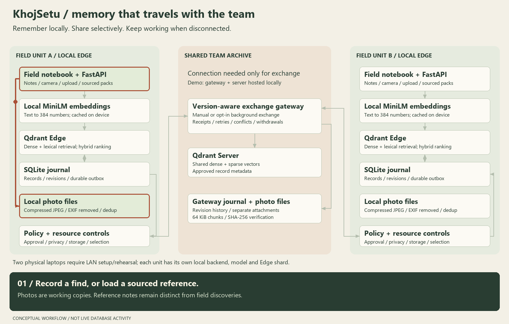
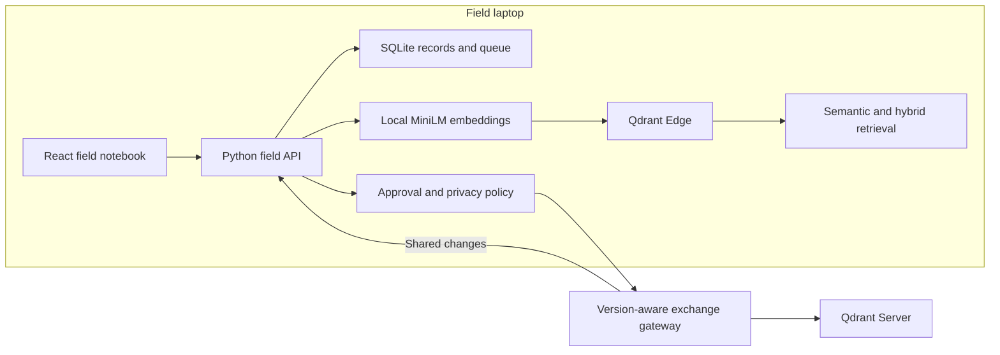

# KhojSetu

**Discover. Remember. Connect.**

Offline semantic memory for archaeological field research, built for Qdrant's **AI-Powered Edge Memory & Intelligence Platform** challenge.

A researcher records a find, searches related observations on the field laptop without internet, and exchanges approved knowledge with the team when connected. Grid, layer and material keep retrieval grounded in excavation context.



*Conceptual workflow animation; not a recording of live database activity.*

## Documentation & Demo

- [Interactive workflow explainer](public/pitch.html) — download/open locally, or visit `/pitch.html` while running the app. GitHub's file view does not execute HTML.
- [Five-minute demonstration](DEMO.md)
- [Setup & Running Locally](START-HERE.md)
- [Architecture, resource budgets and tradeoffs](docs/ARCHITECTURE.md)
- [Preparing small offline reference packs](docs/REFERENCE-PACKS.md)
- [Eight sourced museum references and dataset boundaries](docs/DATASET-SOURCES.md)

## Why this challenge, and why archaeology?

The Qdrant challenge calls for searchable on-device memory, offline vector/hybrid retrieval, intelligent local/shared decisions, synchronization with Qdrant Server, handling of changing information and a visible user interface.

Archaeology is our chosen use case. An observation becomes more useful with its location, layer and relationship to earlier findings. A field notebook that can retrieve related descriptions locally and preserve competing edits gives the challenge a concrete workflow.

Potential users include excavation teams, research programmes and archaeological consultancies. Faster retrieval and better team handover are proposed benefits to validate in a practitioner pilot; we do not claim established adoption or measured business savings.

## What works

| Capability | Current implementation |
| --- | --- |
| Local semantic memory | Real `qdrant-edge-py==0.8.0` Edge shard stored on the device |
| Local embeddings | Cached MiniLM ONNX model via FastEmbed; 384-dimensional dense vectors |
| Hybrid retrieval | Dense cosine and lexical sparse search in Edge; application combines rankings using reciprocal-rank fusion |
| Context filtering | Layer and material filters |
| Field photographs | Camera or upload; metadata-stripped JPEG working copies, displayed in records and search results |
| Offline reference packs | Import up to 100 sourced text references / 1 MiB; local-only by default, resumable within storage budget, existing edits preserved |
| Selective downloads | Choose a site/material for new findings; existing local records keep receiving revisions |
| Device storage | Configurable admission budget, usage breakdown, protected evidence, unused-photo cleanup and removable/restorable downloaded references |
| Persistent field records | SQLite journal, local versions and durable pending state |
| Selective exchange | Sensitivity, researcher approval, visibility and priority rules; limited-link upload prioritization |
| Shared storage | Real Qdrant Server in Docker, accessed through a Python exchange gateway |
| Bidirectional changes | Durable outbox, version-safe acknowledgements, bounded uploads/downloads and opt-in background retry |
| Photo exchange | Explicit approval, resumable 64 KiB chunks and SHA-256 integrity verification |
| Shared withdrawal | Explicit version-checked request, durable tombstone and offline propagation; local edits retained privately |
| Conflict review | Keep local, accept shared, or retain both notes |
| Evidence assistant | Extracts original retrieved notes with record IDs; no external LLM |
| Interface | Field station, archive, search, record form, knowledge exchange and activity |

The sample dataset is **40 synthetic archaeological records**, included in [backend/demo.json](backend/demo.json). They demonstrate the workflow and are not real discoveries or validated archaeological evidence. New field units start empty; choose **Load demo expedition** once to seed the sample data. Personal demo entries and runtime databases are excluded from Git.

## How Qdrant is used



The local API and cached model run on the laptop. Edge performs the actual vector retrieval; SQLite supplies record/queue state. The gateway writes shared vectors to Qdrant Server and maintains a revision journal. Synchronization is application-level record exchange, not a claim of built-in automatic Edge replication.

## Run on Windows

Requirements: Python **3.12**, Node.js **22.14+**, and Docker Desktop for shared-server exchange. No Qdrant account or paid inference API is required for the local setup.

```powershell
git clone https://github.com/kg2655/KhojSetu.git
cd KhojSetu
python -m venv .venv
.\.venv\Scripts\python.exe -m pip install -r backend/requirements.txt
npm ci
.\.venv\Scripts\python.exe -m backend.prepare
npm run build
```

The initial dependency/model downloads need internet. Subsequent field-app startup loads the cached model with `local_files_only=True`.

Open Docker Desktop and wait for the engine, then:

```powershell
.\Start-KhojSetu.ps1 -WithExchange
```

| Local URL | Purpose |
| --- | --- |
| http://localhost:8000 | KhojSetu application |
| http://localhost:8000/pitch.html | Animated explanation |
| http://localhost:6333/dashboard | Qdrant Server dashboard |
| http://localhost:8010/docs | Exchange gateway API |

For recording/search without the shared server, run `Start-KhojSetu.ps1` without `-WithExchange`. For a separate second field unit, run `Start-KhojSetu.ps1 -SecondUnit` and open port 8001. For manual terminal commands if PowerShell scripts are blocked, see [START-HERE.md](START-HERE.md).

Stop this project's services while preserving data:

```powershell
.\Stop-KhojSetu.ps1
```

Closing browser tabs does not stop the backend. Stopping services does not erase saved records. Localhost URLs are not public submission/demo URLs; reviewers must run the application themselves.

## Validation

The updated implementation has passed TypeScript checking, a production frontend build and 25 regression checks using real Qdrant Edge; gateway checks use a disposable real Qdrant Server. Coverage includes the original filter/privacy/conflict/restart cases plus stalled uploads, lost acknowledgements, revoked sharing, storage admission, photo compression, chunk retries, integrity checks, authentication and interrupted gateway writes. Browser verification covered photo upload and saving; physical webcam capture remains a device-specific preflight check.

See [verification instructions](docs/VALIDATION.md) for isolated test setup. Test data must not be mixed with the expedition used for presentation.

```powershell
npm run lint
npm run build
.\.venv\Scripts\python.exe -m pytest backend/test_final_round.py -q
```

The new suite expects a disposable Qdrant Server on port 6334; it creates and removes its own test collections. The original suite additionally requires an isolated running gateway. Small-demo timings are not production benchmarks.

## Resource-aware operation

Under **System & activity**, set the field-data budget (default **512 MiB**) and each direction's transfer allowance (default **256 KiB per cycle**). The model cache is shown separately. Choose an exact site name and/or material to limit new downloads; leave both blank for all approved shared findings. Local recording and search continue while network requests are pending. Background exchange is opt-in and remains paused in field mode.

Each cycle attempts at most 20 record uploads and receives at most 20 changes. Photographs use resumable chunks of at most 64 KiB. Transfer counters cover application change bodies and photo chunks, not HTTP/TLS overhead, health checks or acknowledgements. These are per-cycle limits, not daily data caps.

The storage budget is an admission control, not a filesystem quota. Qdrant's allocated files, database journals and temporary operations can grow in steps. Measurements on the development laptop found about 132 MiB of logical files for an empty Edge shard; the cached embedding model used about 87 MiB separately. These are not RAM figures or universal minimum hardware requirements.

## Photographs

Choose **Use camera** or **Upload photo** in the recording form. Browser camera access requires permission and a supported secure context such as localhost or HTTPS. Uploaded JPEG/PNG/WebP files are limited to 10 MiB and 24 megapixels; working copies are resized to at most 1600 pixels, encoded as JPEG, and stripped of EXIF metadata. Original files are unchanged and must be preserved separately if needed as research evidence.

A photo stays local unless **Also exchange this compressed photo** is selected and the record passes the approval/privacy policy. Metadata can arrive before its photo; the interface distinguishes record synchronization from verified photo transfer. Search uses written descriptions, not image embeddings.

Cleanup only removes unattached files older than 24 hours. It never automatically removes a photograph attached to a record or needed by a pending upload/conflict. Under System & activity, unchanged downloaded references can be explicitly removed and restored. Pinned references, your own observations and locally edited evidence stay protected. Removing a cache entry does not delete its shared copy; index allocation may be reused rather than immediately shrinking.

## Scope and remaining work

- Automatic exchange polls with bounded retries; it is not an operating-system connectivity event subscription.
- Shared changes can be filtered by site/material within transfer budgets. Existing local records remain subscribed to updates. Selection changes replay history without deleting local evidence. Curated reference-pack import remains unimplemented.
- The assistant is extractive, not a generative archaeological expert. Similarity scores are not confidence in historical facts.
- Image similarity search and full-resolution original-photo backup are not implemented.
- The current deployment is single-team localhost with one gateway worker. Optional bearer-token authentication is supported; remote hosting also requires HTTPS. Multi-team authorization and distributed scaling require further work.
- Visibility changes alone do not retract shared records. Use the explicit withdrawal action to remove the active shared record and propagate that state on later exchanges. Locally created/edited evidence is retained privately. Server audit history, retained attachment files and exported copies are not erased; this is not secure erasure.
- Real archaeological data and practitioner evaluation are needed to establish domain quality.
- The laptop camera must be checked on the presentation device. A phone accessing a laptop-hosted page would still depend on that laptop; native phone Edge execution is not part of this release.

## Repository map

- `src/Workstation.tsx`: active interface selected by `src/main.tsx`.
- `backend/app.py`: local API; `vectors.py`: Edge and embeddings; `store.py`: records and exchange; `models.py`: policy.
- `backend/cloud.py`: shared gateway using Qdrant Server.
- `backend/exchange.py` and `worker.py`: bounded transfer, retry and background scheduling.
- `backend/photos.py`: compressed working copies, hashing and resumable chunks.
- `compose.yaml`: local Qdrant Server container.
- `public/`: static assets and standalone workflow explainer.
- `docs/media/`: README animation.
- Original prototype UI files remain available for reference but are not the active entry point. Its historical README is archived under `docs/archive/`.

See [.env.example](.env.example) for optional process environment settings. `.env` is not auto-loaded; set variables in the terminal that launches the service. Keep credentials and runtime data out of commits.
